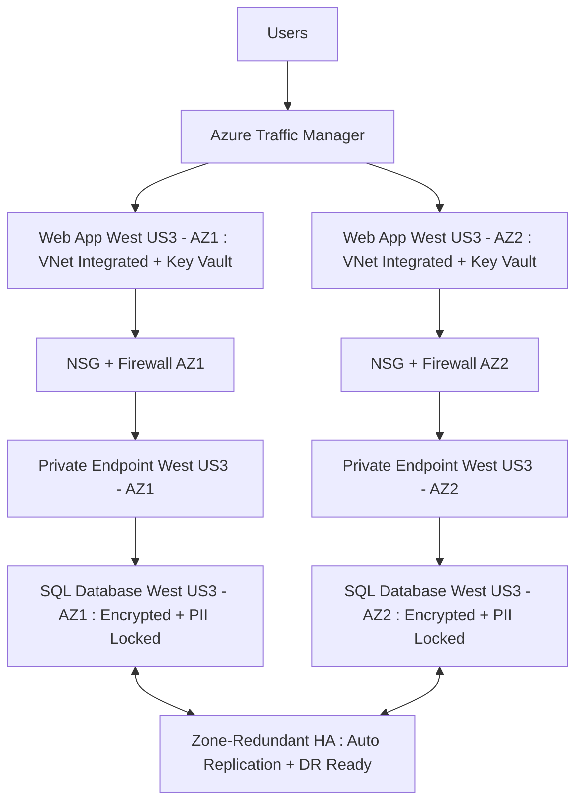

# Azure_Quote-Querying

# 📖 Quotes App – End-to-End Azure + Terraform + Node.js Project

A complete walkthrough of deploying a secure quotes web application in Azure using **Terraform, Node.js, Azure SQL, and Key Vault**.
This README covers **manual setup, automation, troubleshooting, and security** with step-by-step guidance.

---------------

## 📑 Table of Contents

1. [Overview](#-overview)
2. [Architecture](#-architecture)
3. [Prerequisites](#-prerequisites)
4. [Manual Azure Setup](#-manual-azure-setup)

   * [Resource Groups](#resource-groups)
   * [SQL Database](#sql-database)
   * [Networking](#networking)
   * [App Service](#app-service)
   * [Key Vault](#key-vault)
5. [Terraform Automation](#-terraform-automation)

   * [Backend State](#backend-state)
   * [Terraform Files](#terraform-files)
   * [Workflow](#workflow)
6. [Node.js Application](#-nodejs-application)

   * [server.js](#serverjs)
   * [index.ejs](#indexejs)
   * [package.json](#packagejson)
7. [Database Configurations](#-database-configurations)
8. [Security Implementations](#-security-implementations)
9. [Troubleshooting](#-troubleshooting)
10. [Next Steps](#-next-steps)

---------------

## 🌍 Overview

This project provisions a **Quotes Web Application** that:

* Displays random motivational quotes.
* Allows keyword search by author or text.
* Runs on **Azure App Service** with Node.js.
* Uses **Azure SQL Database** (private endpoint).
* Secures DB credentials in **Azure Key Vault**.
* Is provisioned and managed with **Terraform**.


-----------------------

This application has been architected for high availability within a single Azure region (West US 3) by distributing resources across two Availability Zones (AZ-1 and AZ-2).

**- The Web App runs in an App Service Plan with zone balancing enabled, ensuring requests are automatically routed across AZ-1 and AZ-2.**

**- The Azure SQL Database is deployed in General Purpose, Serverless, Zone-Redundant mode, which replicates the database transparently across both AZs.**

**- Connectivity between the Web App and SQL Database is handled through a Private Endpoint, ensuring no public exposure of sensitive data.**

**- All PII data is encrypted, and secrets are stored in Azure Key Vault.**

For this demo, I will only showcase deployment and functionality from Availability Zone 1 (AZ-1) in West US 3, though both zones are active and provide redundancy in case of zone failure.

## High Availability & Security Flow



---------------

## 🏗 Architecture

* **Frontend**: Node.js Express + EJS templates.
* **Database**: Azure SQL (S0, private endpoint).
* **Networking**: Virtual Network + subnets + private endpoint.
* **Security**: Key Vault for secrets, no public DB access.
* **State Management**: Terraform state stored in Azure Blob Storage with locking.
📂 Project Files
 server.js → Express app + SQL connection.
 views/index.ejs → Search UI + results.
 package.json → Node.js dependencies and start script.
 node_modules → where all the npm packages you installed (like express, ejs, mssql, etc.) and their dependencies live.
 main.tf, provider.tf, sql.tf, webapp.tf, outputs.tf → Terraform configuration.
 README.md → Documentation (this file).

----------------

IN Action:

https://github.com/user-attachments/assets/14050269-c850-45fb-b452-3c7779719bcb

---------------

## Prerequisites

* Azure subscription with contributor rights.
* Installed locally:

  * Node.js 20 LTS OR  Node.js 22 LTS
  * Terraform
  * Azure CLI
* VS Code (with Azure extension optional).

Verify:

```
node -v
npm -v
terraform -version
az --version
```

---------------

## 🖱 Manual Azure Setup

### Resource Groups

1. Open [Azure Portal](https://portal.azure.com).
2. In the left sidebar, click **Resource groups**.
3. Click **+ Create**.
4. Name:

   * `daniel-terraform-rg` (for Terraform state).
   * `quote-rg` (for application resources).
5. Region: **East US** for terraform RG, **West US 3** for app RG.
6. Tags:

   * `project = daniel-quote-app`
   * `owner = danielamoh`
   * `environment = dev`

Both RGs should now exist.

---------------

### SQL Database

1. Navigate to **SQL databases** → **+ Create**.
2. Database name: `quotes-db-tf`.
3. Server: create new → `quotes-sqlserver-tf`.

   * Location: West US 3.
   * Admin user: `quotes-sql-admin`.
   * Password: generated later via Terraform (stored in Key Vault).
4. Networking → **Private Endpoint only**.
5. Tags → apply project tags.
6. Click **Review + Create** → **Create**.

DB deployed with no public access.

---------------

### Networking

1. Go to **Virtual Networks** → **+ Create**.
2. Name: `quotes-vnet-tf`.
3. Address space: `11.0.0.0/16`.
4. Add subnets:

   * `db-subnet` → `11.0.0.0/24`.
   * `webapp-subnet` → `11.0.1.0/24`.
5. Create.

VNet with two subnets ready.

---------------

### App Service

1. Go to **App Services** → **+ Create**.
2. Name: `quotes-webapp-tf`.
3. Runtime: Node.js **20 LTS**.
4. Region: West US 3.
5. Pricing: **General Purpose**.
6. Networking → enable **VNet Integration** (use `webapp-subnet`).
7. Configuration → add env vars later (via Terraform).

App Service created.

---------------

### Key Vault

1. Go to **Key Vaults** → **+ Create**.
2. Name: `quotes-kv-tf`.
3. Region: West US 3.
4. Access policies → add Web App system identity.
5. Secrets → add secret `db-passwd`.

Key Vault ready.

---------------

## 🤖 Terraform Automation

https://github.com/user-attachments/assets/27a0371f-92e0-4db4-b943-9c0b4ba576ab

### Backend State

1. Manually create **Storage Account** in `daniel-terraform-rg`:

   * Name: `tfstateinfraamoj001`.
   * Region: East US.
   * Kind: StorageV2.
   * SKU: Standard LRS.
2. Create container: `tfstate`.

Terraform backend config (`provider.tf`):

```
terraform {
  backend "azurerm" {
    resource_group_name  = "daniel-terraform-rg"
    storage_account_name = "tfstateinfraamoj001"
    container_name       = "tfstate"
    key                  = "infra.tfstate"
  }
}
```

---------------

### Terraform Files

* `main.tf` → resource groups, random password.
* `sql.tf` → SQL Server + DB.
* `webapp.tf` → App Service.
* `outputs.tf` → admin credentials, connection strings.

Example snippet (private endpoint):

```
resource "azurerm_private_endpoint" "sql_pe" {
  name                = "quote-sql-pe"
  location            = azurerm_resource_group.app.location
  resource_group_name = azurerm_resource_group.app.name
  subnet_id           = azurerm_subnet.db_subnet.id

  private_service_connection {
    name                           = "quote-sql-privateservice"
    private_connection_resource_id = azurerm_mssql_server.sql.id
    subresource_names              = ["sqlServer"]
  }
}
```

---------------

### Workflow

```
az login
terraform init -reconfigure
terraform plan
terraform apply
```

Infra created with secure networking + state locking.

---------------

## 🖥 Node.js Application

### server.js

* Connects to SQL DB with credentials pulled from Key Vault.
* Provides `/`, `/search`, and `/random` endpoints.

### index.ejs

* Search bar + styled results.
* Animated gradient motivational background.

### package.json

* Dependencies: express, mssql, body-parser, dotenv, ejs, azure-keyvault-secrets.

Run locally:

```
npm install
npm start
```

---------------

## 📊 Database Configurations

Schema:

```
CREATE TABLE Quotes (
  Id INT IDENTITY PRIMARY KEY,
  Quote NVARCHAR(500) NOT NULL,
  Author NVARCHAR(100) NOT NULL
);
```

Example insert:

```
INSERT INTO Quotes (Quote, Author)
VALUES ('Success at anything will always come down to this: focus and effort, and we control both.', 'Dwayne "The Rock" Johnson');
```

---------------

## 🔐 Security Implementations

* **Key Vault** for password storage.
* **Private Endpoint** for SQL traffic.
* **VNet Integration** for App Service.
* **No Public Access** → SQL firewall blocks external traffic.

---------------

## 🛠 Troubleshooting

* **npm not found** → ensure Node.js PATH includes `C:\Program Files\nodejs`.
* **Database error** → ensure DB is online + private endpoint connected.
* **Terraform lock error** → run `terraform force-unlock <LOCK_ID>`.
* **App Service DB access error** → check VNet Integration + private endpoint DNS resolution.
* **Node.js version mismatch** → App Service supports only up to Node.js 20 LTS.

---------------

List of People the quotes are from:
=======

Franklin D. Roosevelt

Albert Einstein

Theodore Roosevelt

Aristotle

Oprah Winfrey

Winston Churchill

Nelson Mandela

Buddha

Pablo Picasso

William James

Napoleon Hill

Japanese Proverb

Peter Drucker

Steve Jobs

Louisa May Alcott

Ralph Waldo Emerson

Eleanor Roosevelt

John Lennon

Will Rogers

Ernest Hemingway

Norman Vaughan

Wayne Gretzky

Chris Grosser

Thomas Edison

Walt Whitman

Lao Tzu

C.S. Lewis

Confucius

Muhammad Ali

Martin Luther King Jr.

Mark Twain

Oscar Wilde

A.P.J. Abdul Kalam

Frank Sinatra

Bruce Lee

Mahatma Gandhi

René Descartes

Hasidic Proverb

Henry David Thoreau

Roy T. Bennett

---------------

## 🏁 Next Steps

* Add authentication (Azure AD).
* Add CI/CD pipeline (GitHub Actions / Azure DevOps).
* Add Application Insights monitoring.
* Consider scaling DB tier.

---------------

## 📌 Tags

All resources tagged with:

* `project = daniel-quote-app`
* `owner = danielamoh`
* `environment = dev`

